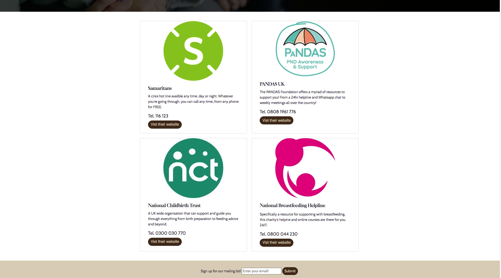
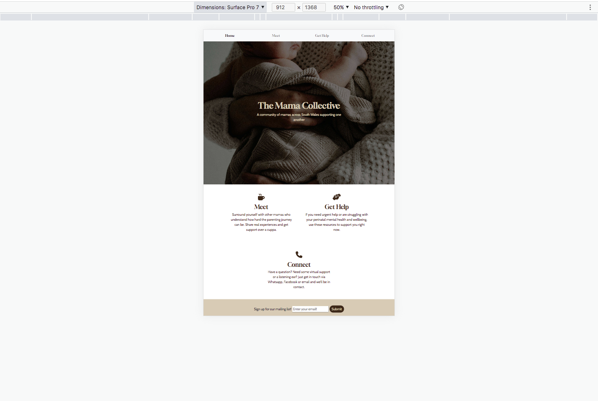

README notes 

# Mama Collective #

Mama Collective is a South Wales based organisation that strives to bring mothers together to support them on this exciting new chapter of their lives.  The website hopes to provide brand authority, achieve bookings for weekly mum and baby groups, share information and create an audience (specifically for a mailing list and Facebook group which are both relevant to their marketing strategy as a whole).  Mama Collective is a not-for-profit organisation that targets first time mothers in the Swansea and Neath Valleys to provide a support group of like-minded women and build communities both in person and in the digital domain. The website will be useful to the organisation’s target market as it will not only share details of in-person classes but also offer further helpful resources for mothers that might be struggling. Along side these two functions the site will also offer users an idea of the brands ethos and offer ways in which they can receive regular information and online companionship. 

# User Experience (UX) #

## Client Objectives: ##
Build an audience (mailing list and socials)
Provide information about local and national support to the target demographic
Receive bookings for groups, hikes and retreats.
Build online support group.
Encourage trust and reliability in the brand.

## Target Demographic: ##
Parents based in South Wales between the ages of 20y/o and 50y/o within a 10 mile radius of the Swansea Valley with a household income between £15k and 50k p/a. Most likely to be Gen X and Millennial on maternity leave or in part time employment (self employed would be ideal to the client based on future plans for the organisation to host parent specific business networking events).

## User Story: ##
Users would like to obtain information quickly and efficiently given the limited time they may have whilst providing care to their children. Users need digestable, relatable and easy to understand information to get the support and help they need in a way that is right for them.

## User stories ##

### First Time Visitor Goals ###

As a First Time Visitor, I want users to easily understand how to receive support.

As a First Time Visitor, I want users to be able to understand the services offered by the organisation.

As a First Time Visitor, I want users to navigate towards the organisations social media pages.

As a First Time Visitor, I want users to sign-up for the organisations mailing list.

### Returning Visitor Goals ###

As a Returning Visitor, I want users to understand what services will work for them.

As a Returning Visitor, I want users to easily contact the organisation to book in for a group or ask a question.

As a Returning Visitor, I want users to feel trust towards the organisations brand and experience familiarity.

### Frequent User Goals ###

As a Frequent Visitor to the site, I want users to understand the ethos and values of the organisation.

As a Frequent Visitor to the site, I want users to smoothly check for other services that may benefit them and their family. 

As a Frequent Visitor to the site, I want users to feel able to rely on the brand to provide them with the information they need consistently.

# Design #

## Colour Scheme ##
The four main colours are Akora, Black Marlin, Dallas and Shadow

## Typography ##

The 'Gloock' and 'Cabin' font is the main font used throughout the whole website with Sans Serif as the fallback font in case for any reason the font isn't being imported into the site correctly. 'Gloock' and 'Cabin' are both clean fonts used frequently in website design. They are appropriate for the brand guidelines and clear to read in all screen sizes.

## Imagery ##
Imagery is important to this client. The large, background hero image is designed to be striking and catch the user's attention. It also has a modern, energetic aesthetic.

## Wireframes ##

Using Balsamiq I created wireframes for the main pages I intended to build to give the client an idea of the layout and formatting. This also enabled me to have an agreed design to work towards. Here are some examples of my wireframes and how they look through Balsamiq

# Features #

## Nav Bar ##

The navigation bar will feature on each and every page of the site and read from left to right starting with the organisations logo to reinforce brand identity and ideally authority. The nav bar will provide user friendly navigation and offer the same order of links on each page starting with the home to be displayed to the right of the logo. It will allow the user to access all pages from wherever they are in the site without using their browsers ‘back’ button.

## Footer ##

The footer section will include both a call to action for users to sign up for a mailing list (a direct objective for the client is to build an audience) and direct links to the organisations social media pages. The social media links utilise icons to make the process of navigating towards the respective pages easier and therefore encouraging more follows (once again fulfilling the clients objective to build an audience). 

## Icon Nav ##
The landing page will feature a quadrant of four links to other important pages in the site. Another of the clients key objectives is to successfully provide parents in need with information to find support, creating a visual led navigation section on the home page helps to fulfil this objective and supports the user story that parents are looking for an easy way to gather information with limited time and concentration.

## Contact Information ##

I have opted for a simple form for the contact page (aka Connect) to minimise the amount of actions a user has too take to make contact. This fulfils the clients objective of providing support to a user demographic that may have limited resources to copy out a number and ring or send an email. I have included a drop-down menu for users to provide the client with more information about their enquiry which will subsequently categorise the priority and objective of the message. 

## Group Information ##

The ‘Meet’ page provides a user with four different options for support via the Mama Collective Organisation, providing both a visual and brief copy for maximum engagement. Copy is to the point and centres around the main details of each group to give a burst of detail. 

## Helpful Resources ##

A ‘Get Help’ page has been included in the site to provide immediate information for parents that may require more urgent need than the organisation can provide. This meets the clients objective of providing information on a variety of ways to support parents. The information has been displayed in a similar way to the ‘Meet’ page to provide consistency to a user and familiarity with how they are able to consume the information and take action immediately i.e. visual aid, brief copy, web link, telephone number. 

## Banner Image and Heading ##

Every page of the website features a banner image underneath the universal nav bar with a clear heading and possible description of the page to make it clear where the user is on the site. It also provides uniformity and familiarity which is important for brand trust and engagement with the user. 

## Features Left to Implement ##

Unfortunately scope and skill set have not allowed for a booking system and blog to be featured in this version of the website. This static website is simply the MVP agreed upon with the client with plans for further iterations in the future when scope and skill set allow. 

# Bugs #

## Navbar Title Colour ##

The colour assignment for navbar-title is being overwritten by the navbar-brand bootstrap class. I have checked the order of CSS sheets and cannot see a reason why this occurs. Currently using an !important tag to ensure the correct colour is shown.

## Footer Social Media Icons ##

There appears to be an issue with the social media nav icons in the footer dropping out of the container when the viewport reduces below 438. 

To combat this I put the entire footer in the Bootstrap grid system to give me clearer control over their placement at different breakpoints. I have used one single container with two rows, each row stretching col-12.

This did not immediately fix the issue but it did provide me with a clearer framework to test out some other potential solutions. 

I first tested whether the size of the icons effected their location on the smaller screen sizes and if the padding and margins around them had any effect. This was not the answer, however by increasing the height of the container by a very minimal amount I was able to ensure the icons remained inside the container with a an almost un-noticable impact on the overall page styling and user experience. 

# Technologies Used #

## Languages Used ##

HTML5
CSS3

## Frameworks, Libraries & Programs Used ##

Bootstrap 4.4.1:
Bootstrap was used to assist with the responsiveness and styling of the website.

## Hover.css: ##
Hover.css was used on the Social Media icons in the footer to add the colour transition while being hovered over.

## Google Fonts: ##
Google fonts were used to import the 'Gloock' and 'Cabin' font into the style.css file which is used on all pages throughout the project.

## Font Awesome: ##
Font Awesome was used on all pages throughout the website to add icons for aesthetic and UX purposes.

## jQuery: ##
jQuery came with Bootstrap to make the navbar responsive.

## Git ##
Git was used for version control by utilizing the Gitpod terminal to commit to Git and Push to 

## GitHub ##
GitHub is used to store the projects code after being pushed from Git.

## Balsamiq ##
Balsamiq was used to create the wireframes during the design process.

# Testing #

## Responsiveness ##
I have tested the site on the following devices, some live and some using Chrome Developer Tools and these are my findings followed by screenshots for visual representation...

### Apple Mac ###

### Ipad Pro ###

### Iphone 6/7 ###

### Kindle Fire ###

### Pixel 5 ###

### Surface Pro 7 ###

## Browser Compatability ##
I tested the following browsers using my Apple Mac...

## Lighthouse ##

## Code Validation ##

I have used an HTML and CSS code validator to validate my work and the results are as follows...

### Home Page ###

### Meet Page ###

### Get Help Page ###

### Connect Page ###

### Form Response Page ###

### Style Sheet ###

## User Stories ##
I have reviewed my initial intentions and agreements with the client about the user stories and they have been fulfilled as follows...

## Features ##
The key technical features of the site have been tested and findings are as follows...

# Deployment #

## GitHub Pages ##

The project was deployed to GitHub Pages using these five steps...

1. Log in to GitHub and head to the GitHub Repository titled 'Mama Collective'

2. At the top of the Repository, find the "Settings" Button on the menu.

3. Scroll through the Settings page until you find the "Pages" under the Code and Automation Section of the side bar menu on the left hand side.

4. Under Build and Deployment "Source" should be selected as "Deploy From Branch". Under the Branch drop down "Main" should be selected.

5. Click "Save" and the page will then auto refresh.

Scroll back down through the page to locate the now published site link in the "GitHub Pages" section. Click "View Site"

## Forking the GitHub Repository ##

When we make a copy of the original repository we can have a version of the repo on our own GitHub account and be able to view or make changes without effecting the original repo.

This can be done by following these steps...

1. Log in to GitHub and find the GitHub Repository titled "Mama Collective".

2. At the top of the Repository, just above the "Settings" button on the menu, click on  the "Fork" Button.

3. You should now have a copy of the original repository in your GitHub account.

## Making a Local Clone ##
1. Log in to GitHub and find the GitHub Repository titled "Mama Collective".

2. Click the "Clone or Download" button.

# Credits #

## Content ##
Copy has been written by myself.

## Media ##
All images have been downloaded from Pexels, a free image library. 

# Acknowledgements #

My Mentor for continuous helpful feedback.
Tutor support at Code Institute for their support.
My partners support and patience througout the build of the site.
My cohort for their constructive criticism, their support and knowledge sharing. 

